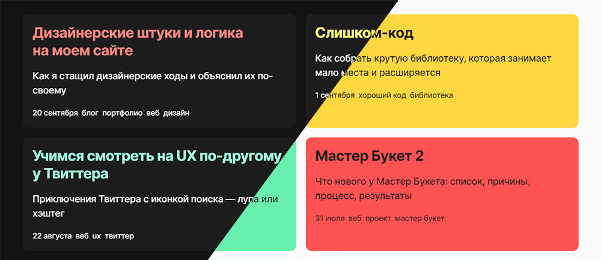

Не буду доказывать, что темная тема нужна, просто вот:

1. [Apple: темная тема в iOS](https://developer.apple.com/design/human-interface-guidelines/ios/visual-design/dark-mode/)
2. [Apple: темная тема в macOS](https://developer.apple.com/design/human-interface-guidelines/macos/visual-design/dark-mode/)
3. [Google: темная тема в Material Design](https://material.io/design/color/dark-theme.html)
4. [Microsoft: темная тема в Windows](https://docs.microsoft.com/en-us/windows/uwp/design/style/color#dark-t0eme)

Темные темы пришли в веб. Теперь Safari, Chrome, Firefox и другие популярные
браузеры поддерживают темную тему для сайта. Используем это. Сейчас расскажу как
сделать темную тему, чтоб никому не было стыдно.


Отправная точка — этот сайт. Можете его полистать. Если он у белый, попробуйте
включить темную тему на телефоне или компьютере. Здесь уже есть поддержка темной
темы, но я вернусь назад — во время разработки.

Блог был оформлен в светлых тонах с яркими блоками — ссылками на статьи. Легко
шагать, потому что фон не цветной. Начну с логики, чтоб понять, как
реализовывать.

## Логика

**Есть:** светлая тема\
**Будет:** основа для работы темной темы

Читатель не ожидает увидеть переключатель темы на сайте, он хочет один раз
установить тему в системе и больше не париться. Если пользователь оставил
светлую тему, темный блог ему не нужен, а если установил темную — светлый блог
тем более не то. Поэтому надо дать задачу устройству определить тему читателя и
установить такую же на сайте.

## CSS

**Есть:** обычный CSS-код\
**Будет:** переменные, чтоб менять всё в одном месте

Идем в CSS и понимаем, что давно надо перейти на переменные. Прописываем правила
с переменными и потом их применяем:

```css
:root {
  /* Создаю переменные с цветами для документа (root) */
  --background-color: #fafafa;
  --foreground-color: #121212;
  --accent-color: #ff5252;
}

div {
  color: var(--foreground-color);
  background-color: var(--background-color);
}

a:hover {
  color: var(--accent-color);
}
```

Гугл:

> "Use dark grey – rather than black – to express elevation and space in an
> environment with a wider range of depth. Apply limited color..."

— уже давно рассказал, что выбирать черный (#000000) для темной темы не стоит —
лучше выбрать темно-серый. Устанавливаем цвета для темной темы. Если их больше,
чем три — фон, текст и акцентный, — то просто менять местами не подойдет, надо
изучать поведение цвета.

```css
@media screen and (prefers-color-scheme: dark) {
  :root {
    /* Перезаписываю переменные с цветами для темной темы */
    --background-color: #121212;
    --foreground-color: #fafafa;
  }
}
```

## Работаем с цветом

**Есть:** обычная смена цветов местами\
**Будет:** замена цветов на другие

Акцентные цвета надо поменять на более светлые, чтоб контраст правильно соблюдался. Но темная тема не только про замену цветов. Гугл советует делать поверхности, которые логически выше, ближе к пользователю светлее. Для того, чтобы расположить элемент одного цвета с фоном, надо задавать рамки.

Нельзя делать большие поверхности яркими, потому что они отменяют действие темной темы и сайт светится. Меняем дизайн так, чтобы темные цвета преобладали. В блоге я сделал так: в светлой теме ссылка на каждую статью в виде блока имеет цветной фон по категориям, в темной теме ссылка имеет темный фон и цветной текст по категориям, но все цвета заменены на более спокойные, чтоб соблюдать контраст.



Для проверки контраста в Chrome сделали приспособление века в инструментах разработчика: открываем инструменты разработчика (Ctrl|Cmd + Shift + I), включаем наведение (Ctrl|Cmd + Shift + C), наводим на текст и видим сразу маленькое окошко, где показана контрастность. Если в стилях нажать на цвет элемента, то появится точная контрастность и линии, помогающие ее настроить.

Используйте этот [инструмент](https://material.io/resources/color/), здесь есть крутые цвета по умолчанию, но можно задавать свои и получать дополнительные для тем.

_**Суммируя:** переменные, правильные цвета, медиа-стили._
