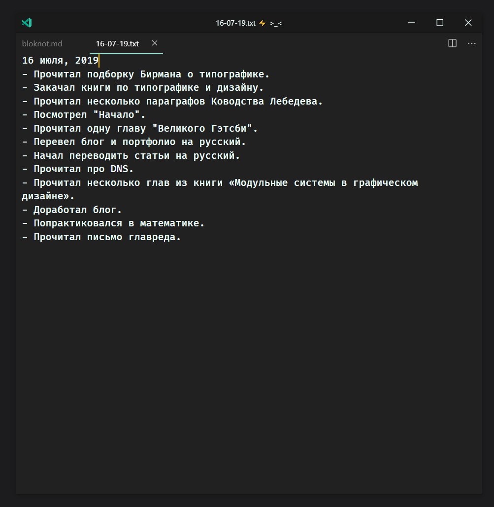

После прочтения больше 50 заметок об искусстве письма, на меня напало
вдохновение и захотелось все документировать.
[Настроил редактор](/blog/all/minimalistic-vscode/) и начал писать. Три раза
заводил дневник по дням и документировал происходящее, верил в пользу: оценивать
день, смотреть на ошибки и бесполезные дела, — но через десять заметок
переставал писать. Я думал, что происходит слишком мало или просто забывал
писать. А потом...

> Внимание, самый крутой, эффективный, полезный, действенный способ писать,
> эксклюзивно и только тут!
>
> Открываешь редактор, создаешь новый файл, пишешь:\
> — Отредактировал текст для сайта.\
> — Прочитал две главы из книги "Модульные системы в графическом дизайне".\
> — Посмеялся с мемов.\
> — Прочитал пять глав Ководства Лебедева.\
> Сделал что-то — написал «Сделал что-то».

### Затраты на такое ведение заметок

| Время                            | Усилия                                            | Ресурсы                                                 |
| :------------------------------- | :------------------------------------------------ | :------------------------------------------------------ |
| 1/10                             | 1/10                                              | 1/10                                                    |
| Сделал — записал. Секундное дело | Переключился на редактор, написал строку, обратно | Файлы занимают мало места, потому что это простой текст |

Браузер открыт на втором рабочем столе, а на первом — остальное для работы:
редактор кода, текстовый редактор, файлы. В конце дня в файл пишу последнюю
строку и не закрываю редактор. Утром просыпаюсь, вижу редактор со вчерашней
заметкой, создаю новую.

Файлы храню в формате `.txt`, поэтому они занимают максимум один килобайт. Базу
бэкаплю, только что это сделал.

