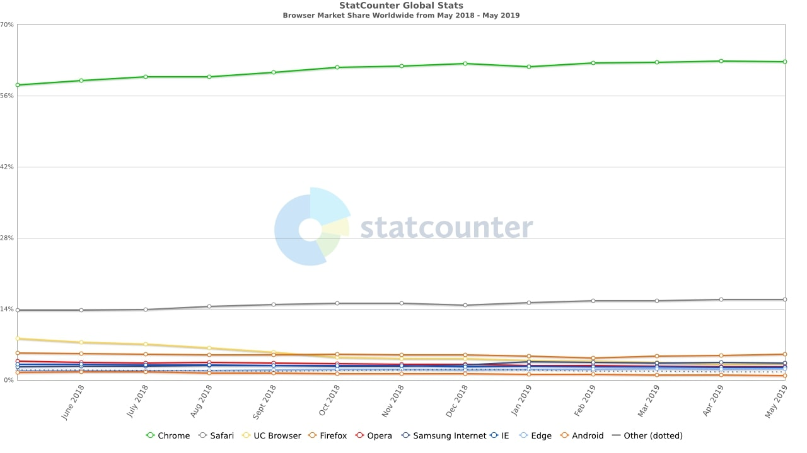
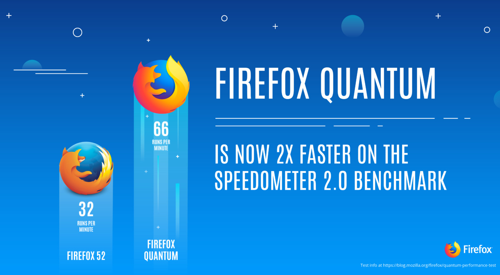

Используешь Хром? У меня плохие новости для тебя. В эру браузерной монополии мы
должны оглядываться на другие браузеры, давайте сделаем это.

## Ситуация

Гугл оккупировал весь веб Хромом. У него больше половины всех юзеров.

Сафари на втором месте только из-за популярности АйОС и МакОС.

## Обновление Файерфокса

Сейчас большинство разработчиков выбирают между Хромом и Файерфоксом. В 2017
году Мозилла выпустила обновленную версию своего браузера — Файерфокс Квантум с
новыми настройками внешнего вида, улучшенной поддержкой расширений, приватностью
и, что самое главное, скоростью. В два раза быстрее, чем старый Файерфокс и
быстрее, чем Хром.

Файерфокс ипсользует собственный движок с новым Квантум ЦСС и Квантум DOM
рендерингом. Много объяснений в
[блоге Мозиллы](https://hacks.mozilla.org/2017/11/entering-the-quantum-era-how-firefox-got-fast-again-and-where-its-going-to-get-faster/).
Хром использует больше оперативной памяти, чем Файерфокс. Также, Файерфокс имеет много полезных фишек, как
[отображение ненужных ЦСС правил](https://twitter.com/nicolaschevobbe/status/1135798960361263104)
и поддержка
[prefers-color-scheme: dark](https://hacks.mozilla.org/2019/05/firefox-67-dark-mode-css-webrender/)
медиа правил, которые у Хрома только в бете.

Боитесь насчет расширений? Сейчас большинство разработчиков пишут расширения для
одинаково Хрома и Файерфокса.

Последняя причина — антимонополия. Надо давать шанс другим компаниям, которые
меньше и тогда станет заметно, как развивается фронтенд. Перенесите все свои закладки в Файферфокс на неделю и попробуйте его.
