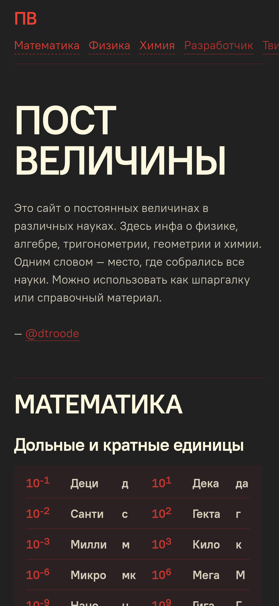
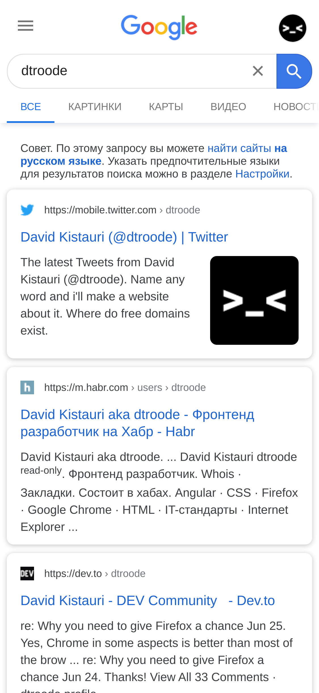
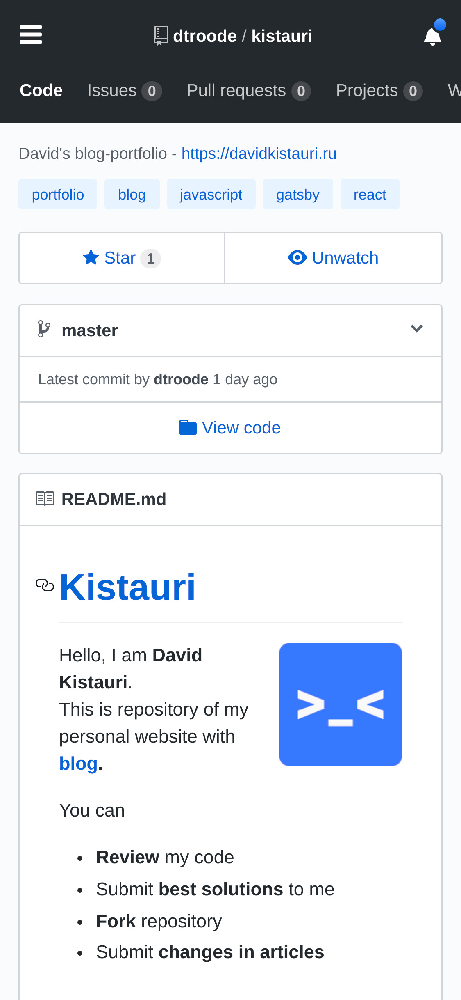
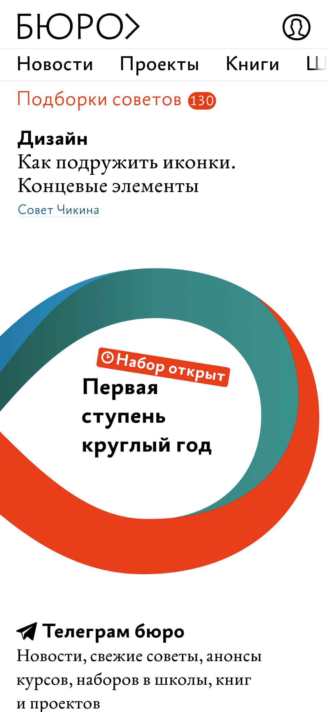

Горизонтальный скроллинг — крутая вещь. На мобильных устройствах постоянно не хватает места, а некоторые штуки лучше не смещать — надо как-то уместить. Поэтому используйте горизонтальный скроллинг. Прятать элементы за гамбургер — плохо, потому что он редко получается круто, не дает информацию сразу и устроен сложнее.

Если расположить элементы вряд, то они займут места ровно одной строки, а засунуть их можно кучу — все видно сразу и скроллится легко.

**Плюсы:**
- Не нужен JavaScript, делается на CSS в пару строк.
- Не нужны лишние настройки для мобильных устройств.
- Не нужно дизайнить еще одно отдельное меню.
- Выглядит свежо.

Сделал себе такое меню на новом сайте Пост Величин:

А еще вот несколько примеров:

|Тинькофф и Гитхаб|Гугл и Горбунов|
|--------|--------|
|
|