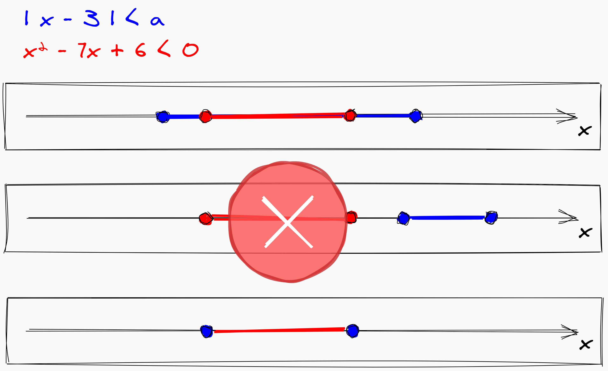

Вот учишься в школе, складываешь числа, находишь площадь фигуры, решаешь уравнения, извлекаешь корни, а потом начинается что-то сложное. В школьной математике самая близкая по уровню рассуждений к высшей математике тема — параметры. Это как будто взяли все, что было раньше, и добавили еще одну переменную. Лучшее описание:

> «Параметр — это буква, которая «никому ничем не обязана» и может принимать любые
допустимые значения. Структура решений уравнения или неравенства зависит от значений параметра; те или иные аспекты этой зависимости и предстоит выяснить в каждой
конкретной задаче»\
_Игорь Яковлев, math us_

Чтоб решать задачи с параметрами, надо понимать, что такое необходимые и достаточные условия.

## Необходимые условия

Сразу к примеру. Чтобы фигура считалась квадратом, она должна быть ромбом, но это еще не все, нужно еще условие того, что все углы прямые. Понимать это можно так: квадрат _не может не быть_ ромбом — он всегда ромб, но ромб _не_ всегда квадрат.

Сложнее понятие необходимости становится с неравенствами:

> Для того, чтобы выполнялось неравенство x^2 − 7x + 6 < 0, необходимо, чтобы выполнялось неравенство |x − 3| < a.

В данном случае мы будем иметь решение первого неравенства — отрезок на числовой прямой — и второе неравенство, которое будет содержать больший промежуток, чем первое. То есть, чтоб x принадлежал меньшему промежутку (1), надо, чтоб он для начала принадлежал большему (2), в котором находится меньший (1). Но данного недостаточно, нужно еще больше ограничить промежуток до меньшего, сузить его.

## Достаточные условия

Достаточные условия — это когда условия достаточно, но оно не обязательно должно быть, можно и по-другому. Например, если существо говорит на английском, то оно точно человек. Но чтоб быть человеком, необязательно говорить на английском, можно и на китайском. Разницу условий на схожем примере можно заметить отсюда:

> Необходимо, чтоб у существа были зубы, чтоб оно считалось человеком, но зубы есть не только у человека, поэтому надо еще больше уточнить, как в большем ограничении промежутка в примере с неравенством. Но если существо говорит на английском, то сомнений нет, что оно — человек.

Условие прошлой задачи с неравенствами можно перевернуть:

> Для того, чтобы выполнялось неравенство |x − 3| < a, достаточно, чтобы выполнялось неравенство x^2−7x+6 < 0.

То есть, если x принадлежит меньшему внутреннему промежутку, то за рамки большего он точно не выйдет.

Имеем общее правило для условий задач: _1 необходимо для 2 = 2 достаточно для 1._ Для неравенств можно перефразировать так: _если неравенства 1 достаточно для неравенства 2, то все решения 1-го содержатся во 2-ом._
