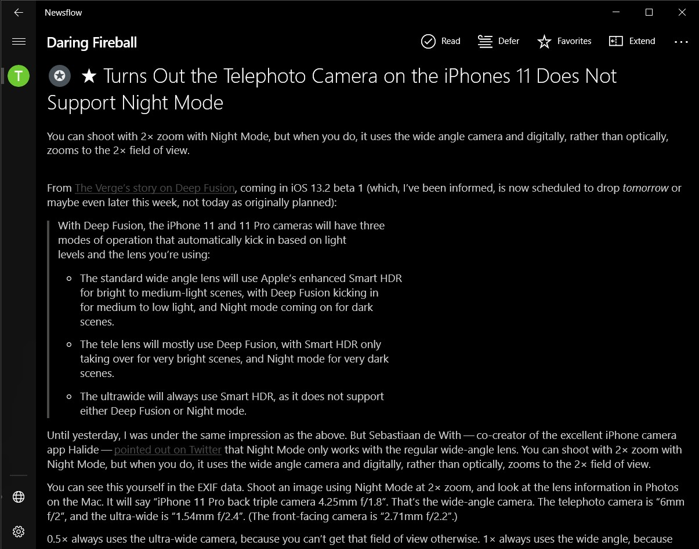

_Ссылка на РСС: [davidkistauri.ru/rss.xml](https://davidkistauri.ru/rss.xml)_

У меня в блоге нет никаких крутых систем подписки, просто есть РСС-лента. РСС —
крутая технология, которая выдает ссылку на один файл для читалки. Файл
обновляется системой и ничего делать не надо.

Чем удобен РСС? Вместо утренней и вечерней проверки всех любимых сайтов, можно
добавить их один раз в програму, чтоб она собирала все в одном месте с
одинаковым привычным интерфейсом для чтения. Ускорение x10.

Для РСС нужна читалка — программа, которая умеет читать РСС-файлы и выдает все в
общую ленту. В ней чаще всего можно настроить интерфейс под себя. Для читалки
создается аккаунт, например [Фидли](https://feedly.com/i/welcome), который
запоминает все и синхронизирует ленту между устройствами.

Краткая инструкция:

1. Открываете читалку
2. Ищите как добавить источник
3. Вписываете ссылку на этот сайт

> Некоторые читалки не умеют подгружать РСС по ссылке на сайт. Для них нужна
> [прямая ссылка](https://davidkistauri.ru/rss.xml)

В моем РСС есть не только статьи из блога, но и страницы проектов. Они оформлены
в виде статей, поэтому тоже включены в подписку. Выходит новый проект — приходит
уведомелние о проекте.

Часто информация из блогов дублируется в Телеграме, поэтому на них не хочется
подписываться, если уже подписан на канал в мессенджере. У меня в блоге только
уникальные заметки, ссылки на которые я раскидываю по соц. сетям.

