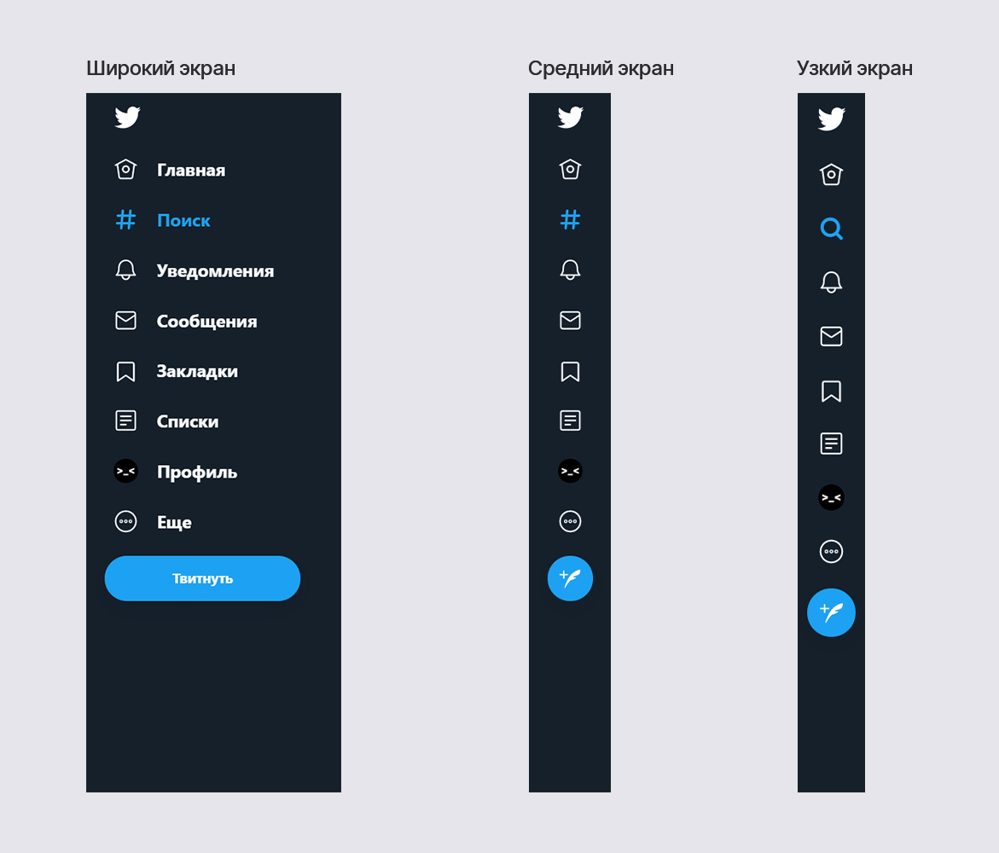

Недавно Твиттер изменили в веб версии иконку поиска на хэштег. Это было не лучшее решение.

- Смена иконки на какую-либо другую всегда вызывает сложности — приходится привыкать, особенно если изменения происходят в соц. сети с миллиардной аудиторией.
- Поиск во всех интерфейсах давно ассоциируется с иконкой лупы, поэтому менять иконку на что-либо другое ради индивидуализма не круто.

Но у Твиттера была другая причина. Изначально домашняя страница всегда была устроена в хронологическом порядке и показывала твиты только тех, на кого пользователь подписан. Потом Твиттер решили использовать алгоритмы, но пользователям это не понравилось и они начали переключать ленту обратно на хронологический порядок.

Твиттер решил, что надо создать вторую ленту и поместили ее в меню поиска, как сейчас сделано у Инстаграма. То есть больше нет меню поиска, а поисковая строка стала частью новой ленты, поэтому Твиттер и решил поменять иконку. Но у пользователей это меню все еще ассоциируется не с хэштегами или второй лентой, а с поиском, поэтому вышло плохо.

Но при этом у Твиттера все еще на каждой странице есть отдельное меню поиска, поэтому логичным выглядит только выбор: или лента по интересам или меню с поиском — мешать не стоит.

Сейчас они поступили так: на широких экранах есть иконки с подписями и поиск подписан словом и обозначен иконкой-хэштегом, а на узких экранах, где подписей нет, иконка меняется на лупу. Но между двумя этими состояниями есть промежуточное, где подписей нет, но иконка обозначена хэштегом.
