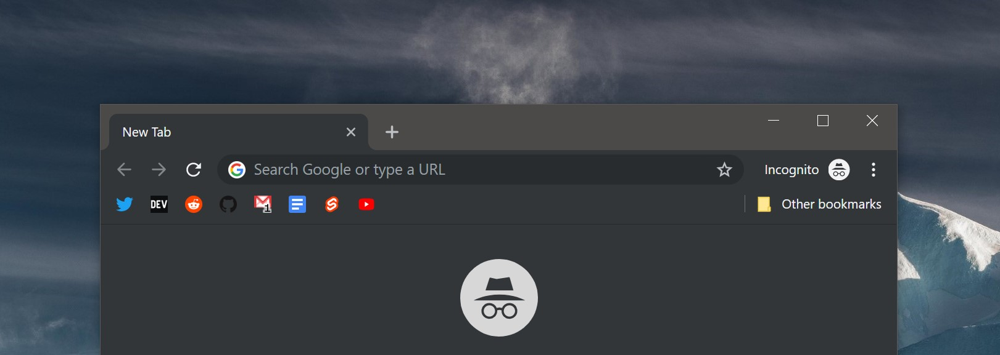

Сохрани, учи, записывай — только в этом порядке. Сегодня я хочу рассказать о
моем процессе учебы и работы. Учеба и работа связаны, потому что в мире
программирования, чтоб работать хорошо, надо учиться хорошо и учиться много.

## Эффективный способ хранить закладки

**Раньше:** закидывал кучу закладок в панель\
**Сейчас:** храню только нужное, убираю имена у ссылок

Я использую Хром и Файерфокс и в обоих у меня всегда включена панель закладок.
На ней я всегда сохраняю только те сайты, которые использую сейчас, поэтому
панель динамична и часто обновляется.

Хоть я и не переполняю панель, я храню закладки без имен — оставляю только
иконки. Еще одно доказательство пользы иконок. _Главный принцип расположения закладок:_ соц. сети и новостные сайты,
инструменты, материала для изучения.

### Социальные сети и новостные сайты

Моя основная соц. сеть — Твиттер. Еще я использую популярный у меня ВК, но
редко. Твиттер я открываю больше десяти раз за день, поэтому Твиттер среди
закладок, ВК — нет.

Новости я получаю из _Дев,_ _Хакерньюз_ и _Реддита,_ но использую их не так
часто, потому что полезный контент часто дублируется в Твиттере официальными
аккаунтами или юзерами.

### Инструменты

В фронтенде надо использовать много веб инструментов: цветовую палитру,
форматтеры кода, сайты для администраторов и документации, — но многие из них
нужны только на старте проекта или при его поддержке, поэтому они не на панели
закладок. Сохраняю только хранилище, как Гугл Драйв, Гугл Кип и Гитхаб.

Я использую Гугл Кип как тудушник для проектов, потому что мне надо создать
доску для проекта, записать туда задачи и отсортировать все. Для сортировки я
использую эмоджи.

### Материал для изучения

Это самая непостоянная часть панели закладок, потому что я добавляю новый
материал, который учу сейчас и удаляю старый. Обычно это курсы, статьи и — самое
важное — документация. Она важна, потому что написана авторами проекта и
обновляется чаще.

Пример: недавно я учил Реакт и в закладках у меня была документация и несколько
дополнительных ссылок. После я решил повторить ООП в Джаваскрипте и добавил
один курс и статью об ООП в ЕS6.

## Необычное место для ссылок

**Раньше:** хранил ссылки в Pocket или не хранил нигде и терял\
**Сейчас:** распределяю ссылки в Телеграме по каналам

Хоть ссылки и сокращены, я люблю минимализм и много закладок не создаю. Поэтому
мне нужно другое место для полезных ссылок и материала «на потом». Для этих
целея я использую Телеграм. Он хорошо как мессенджер, но и хорош как облачное
хранилище. В Телеграме у меня два канала: Inbox и Links.

### Inbox

В этом канале я храню разные материалы, которые я хочу прочитать или выучить
скоро. Этот список часто пополняется и не так часто очищается.

Кэширование. Большинство сайтов со статьями сейчас поддерживают Инстант Вью —
технологию Телеграма, которая позволяет открывать статьи в своем интерфейсе
моментально и изменять режим чтения. Эта функция автоматически кэширует все
ссылки, даже если я сохранил их с ноутбука и не открывал на телефоне.

### Links

Этот канал пополняется редко и только статьями и видео, которые мне не нужны
скоро. Я могу сохранить туда что-то, что мне понадобиться в будущем при изучении
чего-либо или что мне понадобится в спорах как аргумент.

## Как не забыть, что ты выучил вчера

**Раньше:** ничего не записывал и забывал — приходилось перечитывать\
**Сейчас:** все записываю и ничего не забываю

Мне надо постоянно пополнять свои знания новым материалом, выкидывать ненужные
знания и повторять нужные.

В последнее время я для себя открыл новый, хоть и примитивный и очевидный,
способ запоминания — запись. Я читаю документацию и в соседнем окне записываю
ее. Важное: _записывать надо своими словами,_ не копировать, иначе это просто
еще одна версия документации. Я учу английский, поэтому изучение документация и
записывание ее помогает расширять знания языка и набирать опыт.

> [@dtroode](https://twitter.com/dtroode/status/1138419790631055360):
Yesterday started learning [@sveltejs](https://twitter.com/sveltejs). Writing
all to markdown file. All text is written by me, code from examples. You can
see the bold and italic text (red on the left): this is my own thoughts for
better memorization

Для каждого нового материала: язык, Фреймворк, технология — я создаю новую
папку; в ней находится папка с примерами кода и файл `learn.md` для записи. Все
файлы храню в Маркдауне, потому что удобно смотреть превью в ВС Коде, и
регулярно бекаплю.

## Заключение

Моя коллекция нуждается в новых ссылках, отправляйте мне в
[Твиттер](https://twitter.com/dtroode) или в [Телеграм](https://t.me/dtroode)
