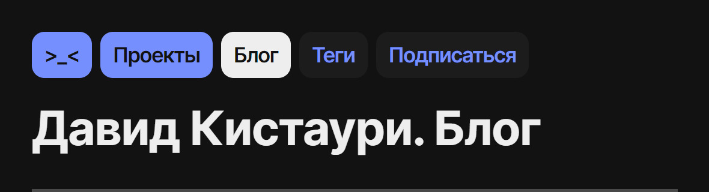

Решил рассказать о всяких мелочах в дизайне сайта. Некоторые штуки я подглядел в других блогах, например у Бирмана и в его [Эгее](https://blogengine.ru), и переделал под свой блог.

## Штука с заголовками

Заголовок показывает иерархию. Если я нахожусь на главной странице, заголовок «Давид Кистаури», если в блоге и списке проектов: «Давид Кистаури. [раздел]», дальше продолжается через точку. Например у раздела тегов в блоге заголовок «Давид Кистаури. Блог. Теги».

Это правило не соблюдается для шаблонных страниц: статей, страниц проектов, разделов для каждого тега, потому что писать «Давид Кистаури. Блог. Как использовать ВС Код, если ты пишешь текст» — издевательство над читателем, особенно тем, кто заходит с телефона.

## Штука со ссылками

Над загловком всегда стоят ссылки в блоках. Они делятся на два типа: постоянные — primary — и непостоянные — secondary. Постоянных три: главная страница, страница с проектами и блог — они представляют разделы сайта; при добавлении нового раздела добавляется и ссылка.

### Постоянные ссылки

Если я не нахожусь на сранице, то ссылка на нее имеет синий фон; если я нахожусь на странице, то ссылка не кликабельна и имеет фон по цвету основного текста страницы — зависит от темы; если я нахожусь на странице, но в ее разделе, то ссылка имеет фон по цвету основного текста, а текст ссылки подсвечивается синим. Это сделано для понимания, где находится пользователь и различия продуктовой страницы и статьи.

### Непостоянные ссылки

Они имеются не всегда и зависят от страницы. В блоге две ссылки: на список тегов и РСС. На странице проекта одна ссылка — на сам проект. Такие ссылки имеют основной фоновый цвет, а текст по стандарту синий.

При ховере постоянных ссылок заливается фон, непостоянных — текст. При фокусе у ссылки появляется внутреняя рамка, заданная через тень.

## Расположение непостоянных ссылок

Помимо шапки и всяких дополнительных вещей, непостоянные ссылки используются в списке тегов и всех статей. Ссылки там расположены неодинаково — в списке тегов они слеплены в кучу, как кирпичи, в списке статей каждая ссылка начинается с новой строки.

Про дизайн кирпичей я [рассказывал](https://t.me/dtroode_channel/419) в канале в Телеграме. Теги я расположил именно так, потому что у них есть связь — в одной статье может быть несколько тегов и их может быть много; чаще заходят не за опеределенным тегом, а для полного списка тем, на которые я пишу.

Ссылки на статьи я расположил по отдельности, потому что каждая статья — отдельная единица контента и слепливание их делает поиск тяжелым. Да и для кирпичного дизайна длинные заголовки статей не подходят — длинных кирпичей я не видел.

## Штука с линейками

Все разделы связываются — или разделяются — линейкой. Над ней всегда большее расстояние, чем под ней. Про этот прием я прочитал у [Игоря Штанга](https://nobelfaik.livejournal.com/175918.html).

## Темная тема

Темная тема нужна. А если продукт — блог, в котором статьи могут быть длинными, то хватит мучать читателя-сову яркими цветами. Задача не просто поменять белый фон на черный, а подобрать цвета, чтоб в темной версии также были видны и различимы все элеенты — работали тени.

Яркие цвета не должны занимать большую площадь и надо правильно подменять элементы, фон и цвет текста. В списке постов я убрал цветной фон у блоков и задал его заголовку — мало яркого, больше темного. Больше про темную тему я расскажу в следующей заметке.
