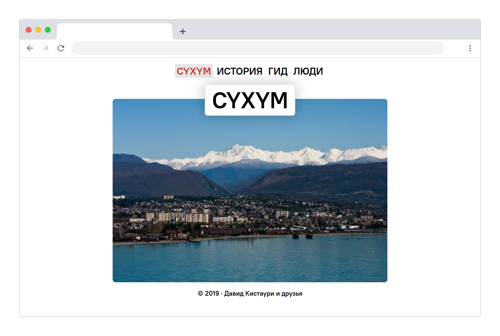
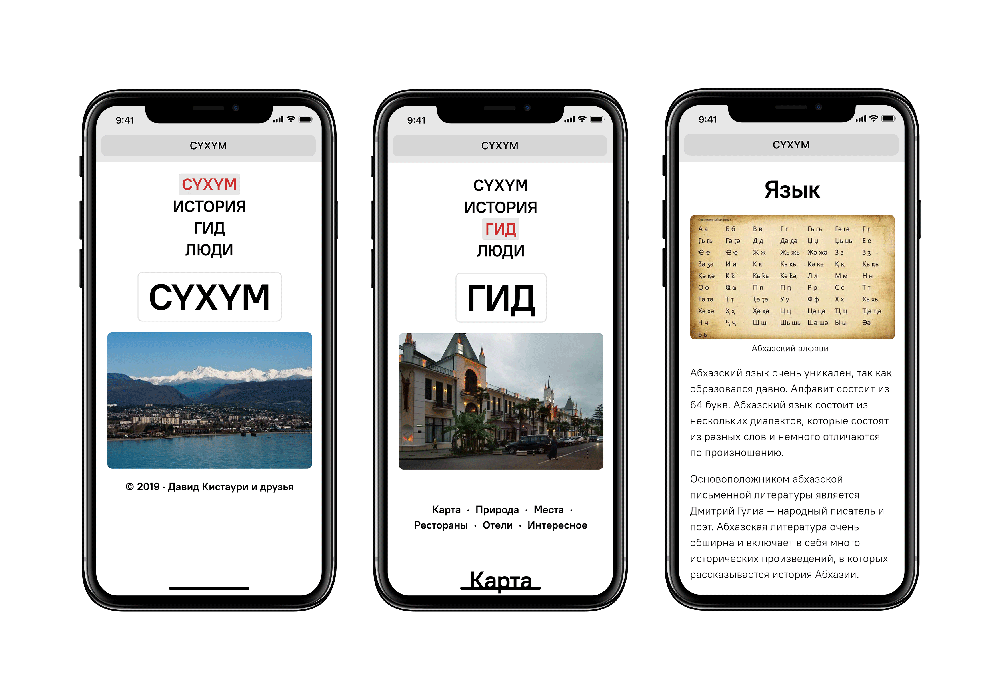
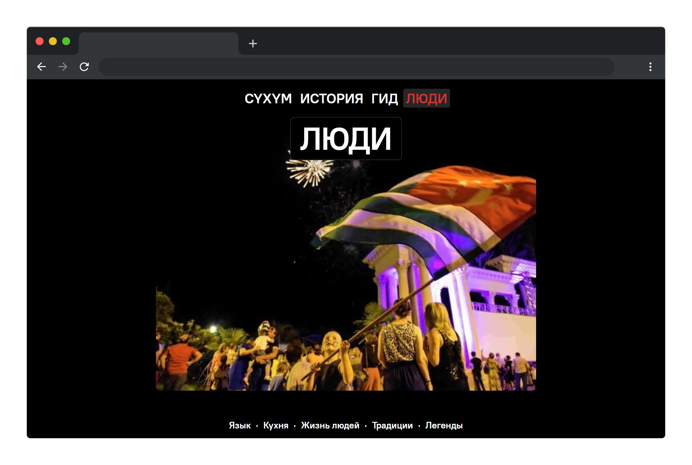

Сайт Сухум рассказывает про туристический и исторический город Сухум, который
находится в Абхазии, на юге от России. Город интересен любителям спокойного
отдыха на пляже и активного — посещения различных частей города, ознакомления с местной
культурой.

Задача проекта — сделать минималистичный сайт о городе, где центр — контент и
ничего не отвлекает.

Цель — показать город иностранным гражданам, показать страну как технически
развитую и молодежь, которая интересуется ИТ-технологиями.

Сайт состоит из 4 основных страниц и нескольких технических. Первая страница
приветствует заголовком с фотографией и ссылками на материал.

Страницы об истории, местах и людях состоят из секций текста с иллюстрациями.
Есть навигация с ссылками на контент страницы, которые плавно прокручивают к
материалу, если браузер умеет.

Сайт Сухума подстраивается под тему телефона, чтоб глаза не уставали в темноте, и
поддерживает мобильные устройства, открывается за секунду, потому что
изображения и текст оптимизированы и код написан правильно.

У цветов есть идеология: красный — сердце, продукт сделан от самого сердца и
город является центром Абхазии; белый — чистота города.

Я руководил проектом и продолжаю администрировать его. Написал весь код сайта и
текст для страниц о местах и людях, создал дизайн и провел небольшой редизайн.
