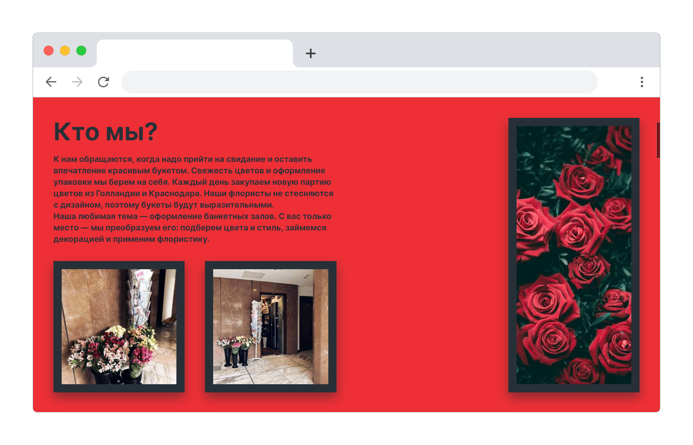
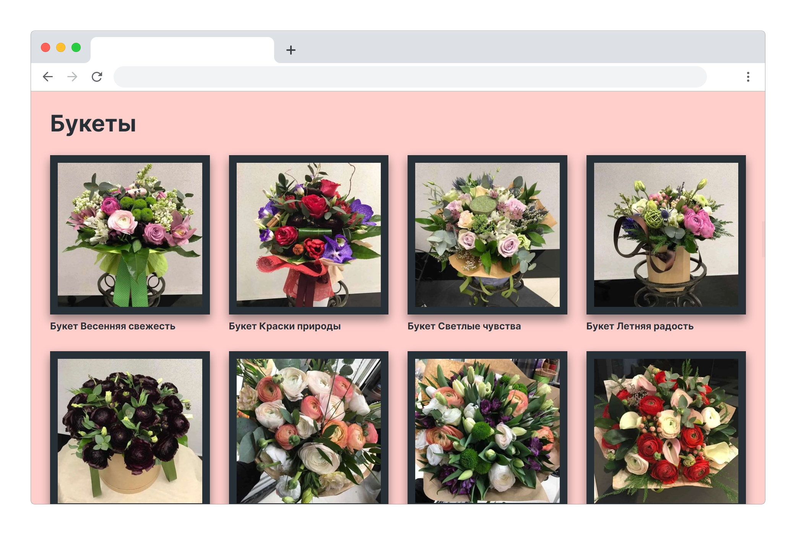
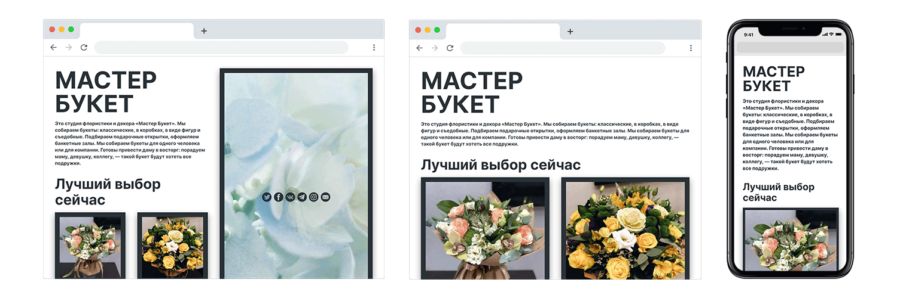

Мастер Букет — цветочная студия, которая делает букеты к празднику и без повода
и оформляет банкетные залы.

Сайт сразу предлагает лучшие букеты в данный сезон. Он разделен на блоки,
которые отвечают на вопросы о компании и рассказывают о преимуществах.

На сайте есть каталог букетов с изображениями и названиями.

Мастер Букет сделан по сетке из четырех горизонтальных блоков, которые сжимаются
до двух на меньшей ширине и до одного на телефонах.

Я руководил всем проектом, написал код, придумал дизайн и [редизайн](/blog/all/masterbuket-2) сайта,
придумал дизайн бренда: логотип, различные вариации его применения,
дизайн-система с типографикой и цветами — и продвигал аккаунты бренда в
Инстаграме, Фейсбуке, ВКонтакте и Твиттере.
