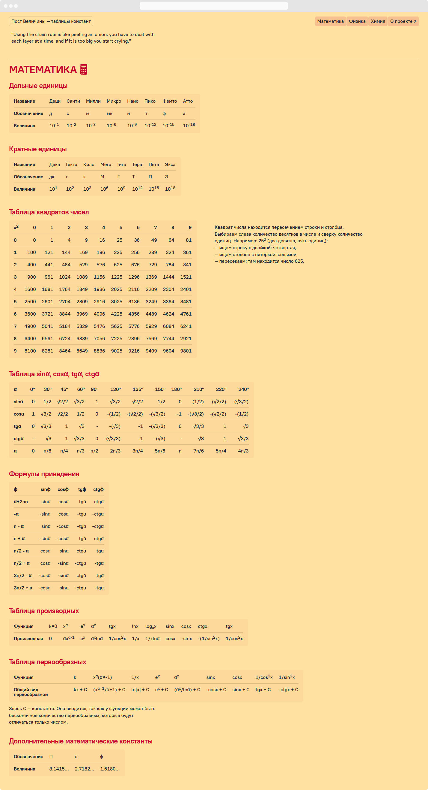

Пост Величины — сайт с таблицами популярных математических, физических и
химических значений. Мне часто приходилось заглядывать в записи или в интернет,
чтоб найти постоянные значения или проверить характеристику вещества в таблице
Менделеева — я захотел сделать сайт, который решит эту проблему.

Задача — создать одно место, в которое всегда можно подглянуть, чтоб узнать
значение какой-то величины: на уроке, на лекции, на работе, когда проснулся
посреди ночи.

Сайт состоит из нескольких секций: математическая, физическая и химическая.
Каждая секция — это несколько таблиц с названиями. Таблицы открываются на
телефонах и листаются горизонтально.

Я занимался всем проектом от идеи до запуска: написал код, сделал дизайн,
собрал материал и залил на сайт.
