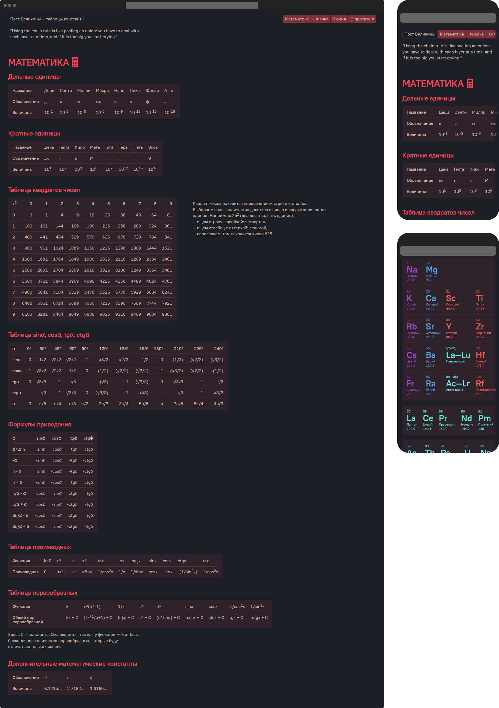

_Редизайн и перестройка проведены осенью-зимой 2019 года._

**Пост Величины — сайт с таблицами основных математических, физических и химических значений и преобразований. Одно место, чтоб проверить все сразу, на уроке, лекции, работе или посреди ночи, когда появилась идея.**


Я создал сайт для личного использования, чтоб не гуглить одно и то же, а потом он перерос в публичный проект.

- нет лишнего, только числа и значения, чтоб моментально подставить в задачу,
- грузится быстро, нет картинок, чтоб получить контент сразу,
- таблицы листаются горизонтально, чтоб на телефоне не нужно было нажимать лишних кнопок, контент сразу тут,
- в шапке лежат ссылки на все разделы, чтоб быстро попасть к физике или химии,
- сайт поддерживает темную тему, чтоб помочь с решением уравнения даже ночью,
- таблица Менделеева разделена по цветам с подписями и расположена в книжном формате, чтоб не путаться с расположением элементов,
- лантаноиды и актиноиды находятся в отдельных таблицах, чтоб не забивать основную.




## Техническая часть

Сайт написан на Pug. Он берет таблицы, кладет их в раздел, помещает раздел в основной файл, генерирует из этого HTML и отдает на экспорт. Компоненты максимально разбиты на части, `head` сайт лежит отдельно, как и `header`, `footer` и каждый раздел.

```pug
<!DOCTYPE html>
html(lang="ru")
  include head/head.pug
  body
    include header/header.pug
    main
      include pages/maths/maths.pug
      include pages/physics/physics.pug
      include pages/chemistry/chemistry.pug
    include footer/footer.pug
```

Стили изолированы по папкам: для таблиц отдельный файл, для header'a другой. Все стили собираются в один основной файл. Темная тема и стили для маленьких экранов прописываются после основных стилей элемента, к которому они применяются, поэтому нет отдельных файлов.


Каждый раздел находится в отдельной папке: там таблицы в JSON и основная верстка с кодом, собирающим таблицы. Таблицы собираются при помощи mixin'ов, которые проходят по JSON и переводят контент в верстку. Для каждого типа таблицы отдельная функция перебора. Сайт развивается вместе со мной: узнаю что-то новое, замечаю это во второй раз, в третий, в четвертый, понимаю, что надоело гуглить таблицу, добавляю на сайт. А это удобно делать через JSON: определяю, какого типа будет таблица, записываю в файл с контентом и даю имя на английском для навигации, а потом просто объявляю новую таблицу в разделе одной строкой. Если такого типа верстки еще не встречалось, то нет труда написать новый шаблон — все делается на основе уже имеющихся.

```pug
// Импорт таблицы
include maths.content.pug

// Код переборки горизонтальной таблицы (напр. таблица дольных единиц)
mixin horizontal_table(list)
  h3= list.name
  section.table-container
    table(caption= list.name)
      each row in list.content
        tr
          th= row.head
          each val in row.body
            td
              | !{val}

// Код переборки угловой таблицы (напр. таблица квадратов чисел)
mixin corner_table(list)
  h3= list.name
  section.table-container
    table(caption= list.name).right
      each row in list.content
        tr
          each val in row.head
            th
              | !{val}
          each val in row.body
            td
              | !{val}

section.main__math#math
  hr
  h2
    | Математика
    // SVG-код для иконки

  // Переборка каждой импортированной таблицы
  +horizontal_table(doln)
  +horizontal_table(crat)
  +corner_table(squares)
  +corner_table(trigonometry_func)
  +corner_table(ghostly)
  +horizontal_table(derivative)
  +horizontal_table(antiderivative)
  +horizontal_table(constants)
```

На сайте нет JS-кода, поэтому генерируется чистый HTML с CSS.


Я занимался всем проектом от идеи до запуска: написал код, сделал дизайн,
собрал контент и залил на сайт.

---

***Шрифт:*** [PT Root UI](https://www.paratype.ru/fonts/pt/pt-root-ui).\
***Материалы взяты из интернета.***
