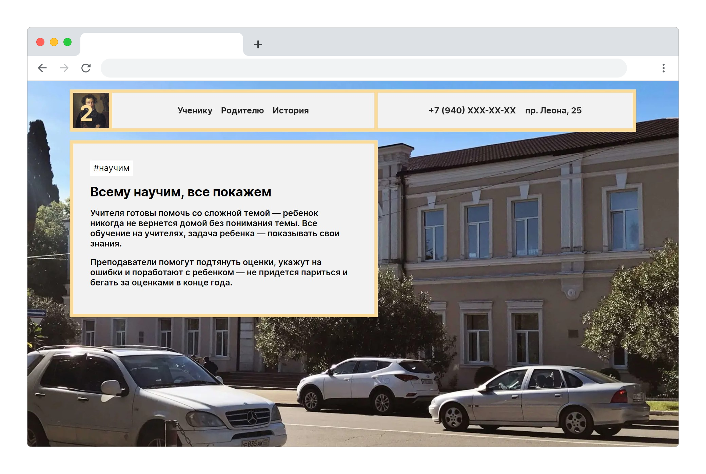
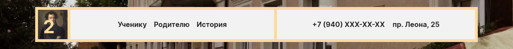

Сайт второй школы — первый сайт среди всех школ Абхазии. Вторая школа — это
центральная школа страны, которая находится в столице — в Сухуме. Школа работает
с 1870 года.

Этот сайт — созданный заново аналог старого сайта. Сайт рассказывает про школу,
ее историю и имеет пополняющиеся разделы для учеников и родителей.

Задача — переделать старый сайт, создать дизайн, который напоминает о здании
школы, написать текст, который проходится по главным вопросам родителей.

Дизайн сделан по сетке из двух горизонтальных клеток. В шапке находится вся
нужная информация: ссылки на разделы для учеников, родителей и об истории,
номер телефона и адресс с ссылкой на карту. Блоки на сайте окружены рамками —
ассоциация с цветами здания школы и рамками у окон.

Текст разделен на смысловые куски, для каждого сделан отдельный блок с фоном.
Смысловой блок содержит хештег для краткого информирования, заголовок, текст и
изображение с ссылкой на материал, если есть.

Я придумал проект, написал код и текст, придумал дизайн и редизайн.
